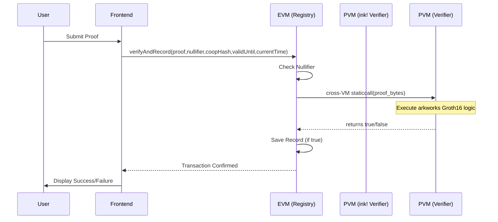

# Architecture: EVM-to-PVM Cross-VM Call

This document describes how the OIAP Verifier bridges the EVM and PVM execution environments on Polkadot Hub.

## High-Level Flow

1. **User Request**: A user submits a ZK proof via the **Next.js Frontend**.
2. **EVM Entry**: The transaction hits the `VerificationRegistry.sol` (Solidity) contract.
3. **Cross-VM Dispatch**: The contract calls `OIAP_Tracer_Caller.verifyProof()`, which uses a low-level `staticcall` to the H160 address of the PVM contract.
4. **PVM Execution**: Polkadot Hub's `pallet-revive` intercepts the call and routes it to the **Rust ink!** contract.
5. **Verification**: The Rust contract uses the `arkworks` library to perform Groth16 pairing operations in a `#![no_std]` Wasm environment.
6. **Result Return**: A boolean result is bubbled back up through the EVM context.
7. **State Update**: If valid, the EVM contract records the `nullifier` to prevent replay attacks.

## Sequence Diagram

## Data Encoding

- **Solidity to Rust**: Proof points (G1/G2) are passed as raw `bytes`. Public inputs are encoded as `bytes32` Fr field elements in this order: `nullifier`, `cooperativeHash`, `validUntil` (LE bytes32), `currentTime` (LE bytes32).
- **Rust Side**: The `zk_verifier` contract uses `ark-serialize::CanonicalDeserialize` to rebuild the Elliptic Curve points from the byte buffer.
