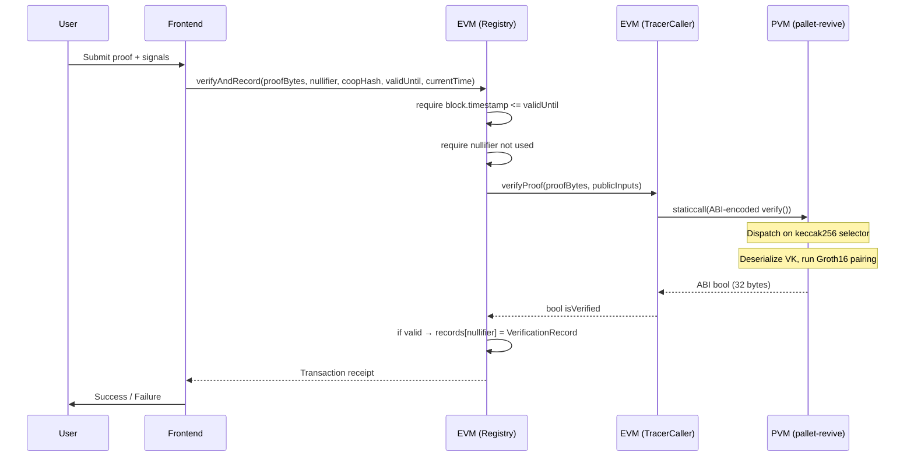

# Architecture: EVM-to-Polkavm Cross-VM Verification

This document describes in detail how the OIAP Verifier bridges the EVM and Polkavm (`pallet-revive`) execution environments on Polkadot Hub. It covers the full call flow, data encoding contracts, and the rationale behind key design decisions.

---

## High-Level Call Flow

```
1. User submits a ZK proof via the Next.js Frontend.
2. The frontend calls  VerificationRegistry.verifyAndRecord()  on the EVM.
3. The registry validates expiry and nullifier uniqueness, then encodes public inputs.
4. It delegates to  OIAP_Tracer_Caller.verifyProof()  which issues a cross-VM staticcall.
5. pallet-revive intercepts the call at the PVM contract's H160 address.
6. The Polkavm contract (pvm_zk_verifier, native Rust) runs full Groth16 pairing.
7. A boolean result (ABI-encoded, 32 bytes) is returned back through the EVM context.
8. If valid, the registry records a VerificationRecord keyed by the nullifier.
```

## Sequence Diagram



---

## Components

### `VerificationRegistry.sol`

The primary EVM entry point for external callers.

**Responsibilities:**
- Expiry check: `require(block.timestamp <= validUntil)`
- Replay protection: reverts if `records[nullifier].verifiedAt != 0`
- Encodes public inputs as LE bytes32 Fr field elements
- Delegates verification to `OIAP_Tracer_Caller`
- Persists `VerificationRecord` on success
- Anti-spam fee: optionally requires `msg.value >= verificationFee` (owner-configurable, default 0)

**VerificationRecord struct:**

| Field | Type | Description |
|---|---|---|
| `cooperativeHash` | `bytes32` | Cooperative identifier (Fr field element) |
| `verifiedAt` | `uint256` | Block timestamp when proof was verified |
| `validUntil` | `uint256` | Proof expiry (unix timestamp) |
| `verifiedBy` | `address` | EOA or contract that submitted the proof |

### `OIAP_Tracer_Caller.sol`

Thin EVM adapter that issues the cross-VM `staticcall` to the Polkavm contract.

**Responsibilities:**
- ABI-encodes calldata with `abi.encodeWithSelector(IZKVerifier.verify.selector, proofBytes, publicInputs)`
- Issues `staticcall` to the PVM contract's H160 address
- Decodes the ABI `bool` from return data

**Cross-VM calling conventions (pallet-revive):**
- PVM contracts are accessible at an H160 address via Revive
- Calldata uses the standard keccak256 4-byte selector (NOT BLAKE2)
- The PVM contract dispatches on this selector internally

### `pvm_zk_verifier` (Polkavm, RISC-V)

Deployed as a native Rust binary on Polkavm via `pallet-revive`. Compiled with `cargo +nightly` against the `riscv64emac-unknown-none-polkavm` target.

**Responsibilities:**
- `deploy()`: No-op. VK is embedded at compile time.
- `call()`: Reads calldata, validates size, dispatches on keccak256 selector
- `verify_proof(input)`: Full ABI decode → Groth16 pairing → bool result

**Key implementation details:**
- 1 MiB static heap via `picoalloc` (no OS allocator in `no_std`)
- MAX_CALLDATA_BYTES = 256 KiB guard prevents heap exhaustion
- `PreparedVerifyingKey` cached in a `static mut` with a boolean init guard (safe: PVM execution is single-threaded)
- ABI decoding is manual (no `std::io`), validated with bounds checks

### `pvm_verifier` (wasm32, library)

A `no_std`-compatible Rust library containing the shared Groth16 verification logic, also usable in Wasm environments. The Polkavm verifier and this library share the same core algorithm; the difference is the host environment and ABI layer.

When compiled with `std` (for testing), it uses `OnceLock` for PVK caching.

### `prover-cli` (Rust CLI)

Developer tooling for converting between snarkjs artifact formats and the on-chain binary format.

| Subcommand | Purpose |
|---|---|
| `detect-signals` | Inspect VK + public JSON; print numbered index table; write `signals_config.json` |
| `vk-to-bin` | Convert snarkjs `verification_key.json` → compressed Arkworks `verification_key.bin` |
| `proof-to-bridge` | Convert snarkjs `proof.json` + `public.json` → `verifier-inputs.json` for frontend |
| `generate --mock` | Emit mock hex payloads for demo/testing pipelines |

---

## Data Encoding

### EVM → Polkavm (calldata)

`OIAP_Tracer_Caller` issues:

```
abi.encodeWithSelector(
    IZKVerifier.verify.selector,  // keccak256("verify(bytes,bytes)")[0:4]
    proofBytes,                   // 256 bytes: G1(64) || G2(128) || G1(64)
    publicInputs                  // 4 × 32 bytes Fr field elements
)
```

### Public Inputs Layout

The 4 public inputs are packed in this order, each as a 32-byte **little-endian** Fr field element:

| Index | Field | Encoding |
|---|---|---|
| 0 | `nullifier` | LE bytes32 (raw Fr) |
| 1 | `cooperativeHash` | LE bytes32 (raw Fr) |
| 2 | `validUntil` | `_toLittleEndianBytes32(uint256)` |
| 3 | `currentTime` | `_toLittleEndianBytes32(uint256)` |

**Why little-endian?** Arkworks' `CanonicalDeserialize` on `Fr` expects LE byte order. The Solidity contract uses an assembly loop that reverses bytes from the EVM's native BE representation.

### Polkavm → EVM (return data)

A 32-byte, right-padded, ABI-encoded bool:
- `0x0000...0001` — proof valid
- `0x0000...0000` — proof invalid

### Proof Byte Format

The 256-byte `proofBytes` field is Arkworks' `serialize_compressed` output of a Groth16 proof:

| Bytes | Content |
|---|---|
| `[0..64]` | `proof.a` — G1 compressed (BN254) |
| `[64..192]` | `proof.b` — G2 compressed (BN254) |
| `[192..256]` | `proof.c` — G1 compressed (BN254) |

---

## Security Properties

| Property | How it's enforced |
|---|---|
| Proof expiry | `block.timestamp <= validUntil` in Solidity (before cross-VM call) |
| Replay prevention | Nullifier stored in mapping; reverts on second use |
| Proof validity | Groth16 pairing check in native Rust; `false` on any parse error |
| Spam resistance | Optional `verificationFee` (owner-set, default 0) |
| Heap exhaustion | MAX_CALLDATA_BYTES (256 KiB) guard in PVM contract |

---

## Deployment Notes

- The `pvm_zk_verifier` binary must be deployed to Polkadot Hub first; its H160 address is then passed to `OIAP_Tracer_Caller`'s constructor.
- The `VerificationRegistry`'s constructor takes the `OIAP_Tracer_Caller` address.
- The verification key is embedded at compile time. Changing the circuit requires redeploying both Rust binaries and re-running `prover-cli vk-to-bin`.
- `NEXT_PUBLIC_REGISTRY_ADDRESS` must be set in the frontend environment to the deployed `VerificationRegistry` address.
